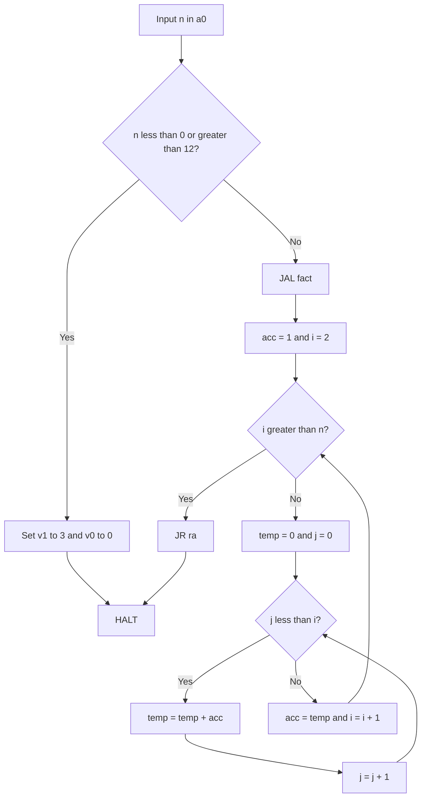

# Factorial flowchart

```mermaid
flowchart TD
 A[Input n in a0] --> B{n less than 0 or greater than 12?}
 B -->|Yes| C[Set v1 to 3 and v0 to 0]
 C --> Z[HALT]
 B -->|No| D[JAL fact]
 D --> E[acc = 1 and i = 2]
 E --> F{i greater than n?}
 F -->|Yes| G[JR ra]
 G --> Z
 F -->|No| H[temp = 0 and j = 0]
 H --> I{j less than i?}
 I -->|Yes| J[temp = temp + acc]
 J --> K[j = j + 1]
 K --> I
 I -->|No| L[acc = temp and i = i + 1]
 L --> F
```
