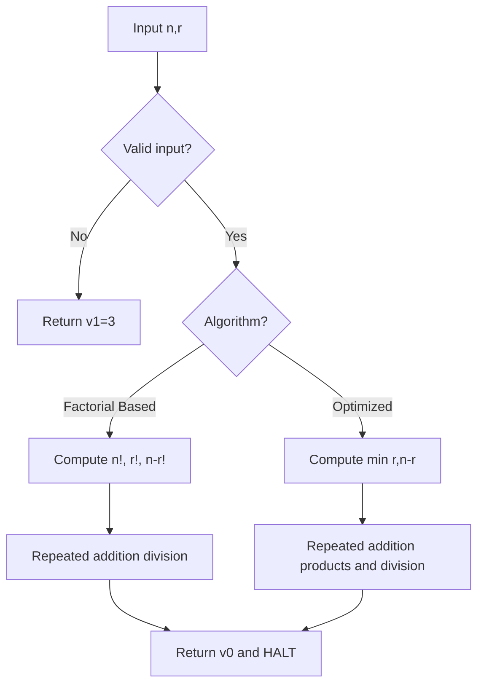

# nCr flowchart

```mermaid
flowchart TD
 A[Input n,r] --> B{Valid input?}
 B -->|No| C[Return v1=3]
 B -->|Yes| D{Algorithm?}
 D -->|Factorial Based| E[Compute n!, r!, n-r!]
 E --> F[Repeated addition division]
 D -->|Optimized| G[Compute min r,n-r]
 G --> H[Repeated addition products and division]
 F --> I[Return v0 and HALT]
 H --> I
```
